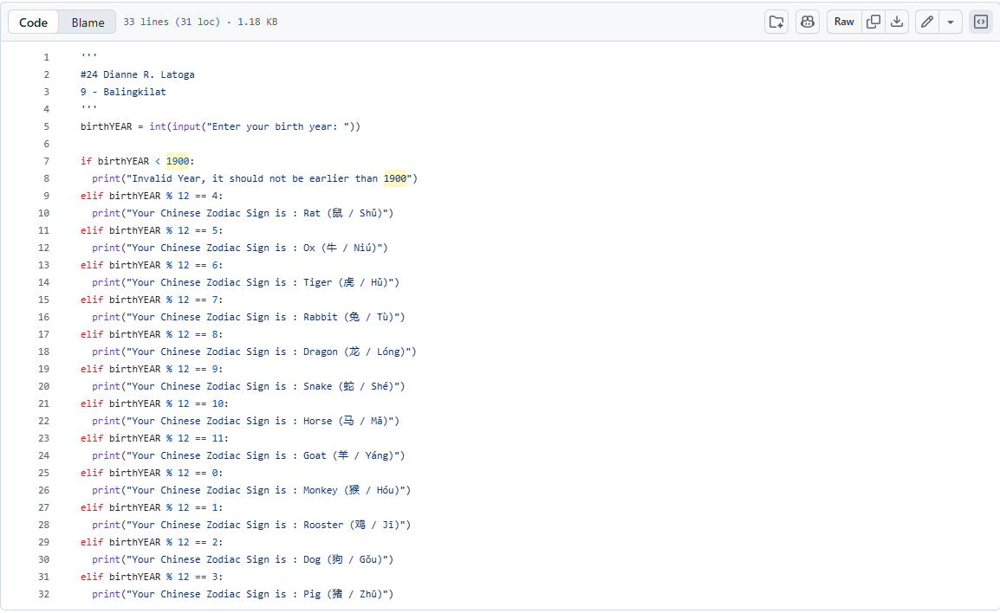

**Section:** Balingkilat

**C# / Name:** 24 Dianne R. Latoga **Date:** 08/13/2026


link to code: https://github.com/diyansidianne/CS-portfolio/blob/main/q1/q1_sg2_a3.py

```
{
'''
	#24 Dianne R. Latoga
	9 - Balingkilat
	'''
	birthYEAR = int(input("Enter your birth year: "))
	
	if birthYEAR < 1900:
	  print("Invalid Year, it should not be earlier than 1900")
	elif birthYEAR % 12 == 4:
	  print("Your Chinese Zodiac Sign is : Rat (鼠 / Shǔ)")
	elif birthYEAR % 12 == 5:
	  print("Your Chinese Zodiac Sign is : Ox (牛 / Niú)")
	elif birthYEAR % 12 == 6:
	  print("Your Chinese Zodiac Sign is : Tiger (虎 / Hǔ)")
	elif birthYEAR % 12 == 7:
	  print("Your Chinese Zodiac Sign is : Rabbit (兔 / Tù)")
	elif birthYEAR % 12 == 8:
	  print("Your Chinese Zodiac Sign is : Dragon (龙 / Lóng)")
	elif birthYEAR % 12 == 9:
	  print("Your Chinese Zodiac Sign is : Snake (蛇 / Shé)")
	elif birthYEAR % 12 == 10:
	  print("Your Chinese Zodiac Sign is : Horse (马 / Mǎ)")
	elif birthYEAR % 12 == 11:
	  print("Your Chinese Zodiac Sign is : Goat (羊 / Yáng)")
	elif birthYEAR % 12 == 0:
	  print("Your Chinese Zodiac Sign is : Monkey (猴 / Hóu)")
	elif birthYEAR % 12 == 1:
	  print("Your Chinese Zodiac Sign is : Rooster (鸡 / Jī)")
	elif birthYEAR % 12 == 2:
	  print("Your Chinese Zodiac Sign is : Dog (狗 / Gǒu)")
	elif birthYEAR % 12 == 3:
	  print("Your Chinese Zodiac Sign is : Pig (猪 / Zhū)")
}
```





